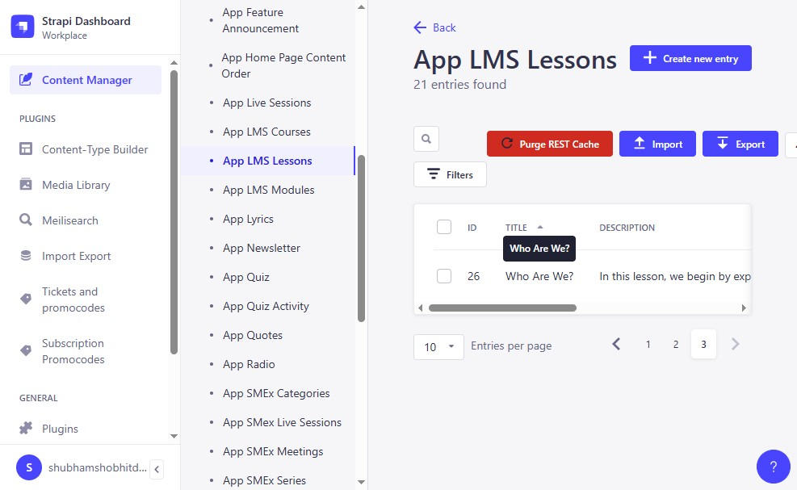
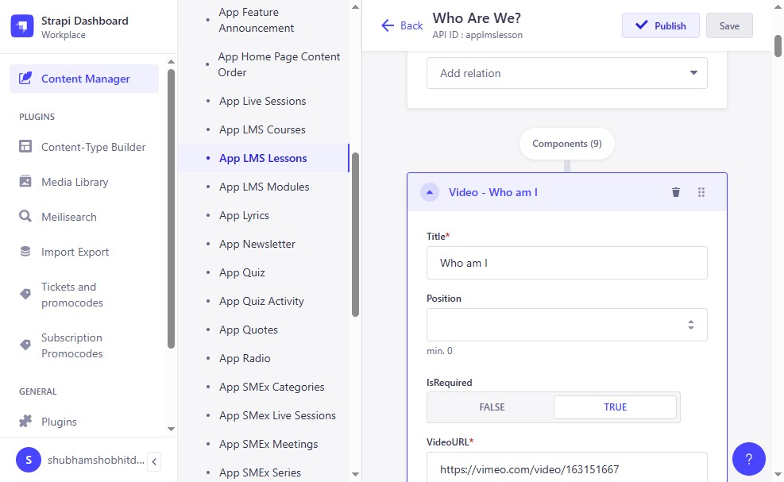
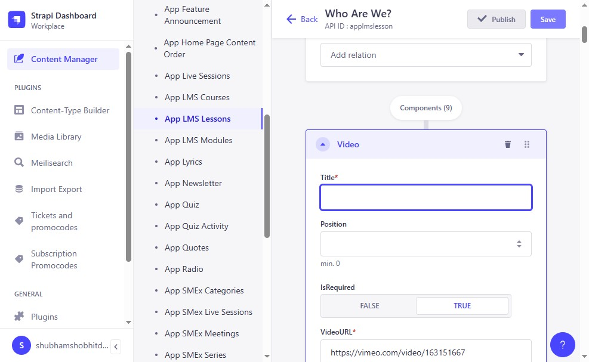
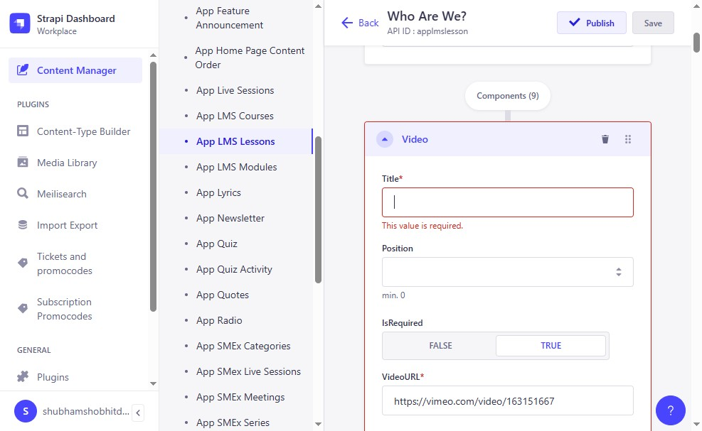
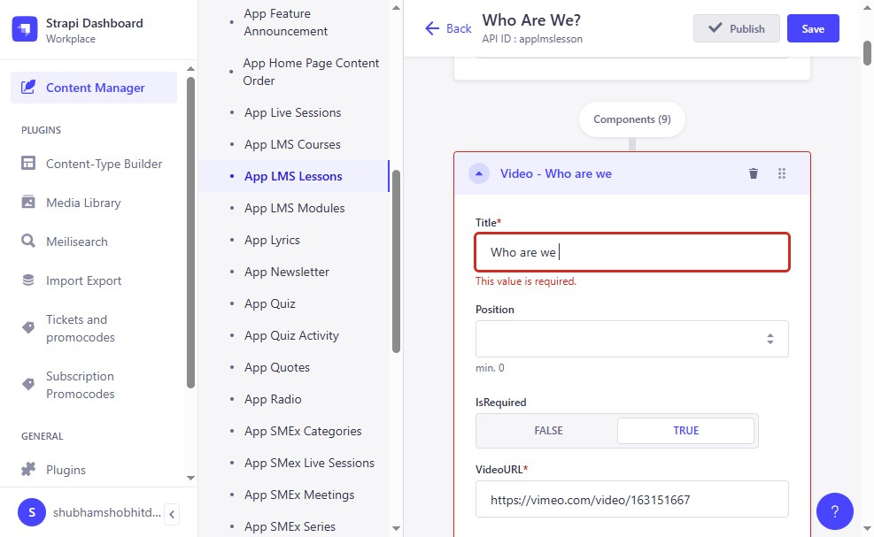
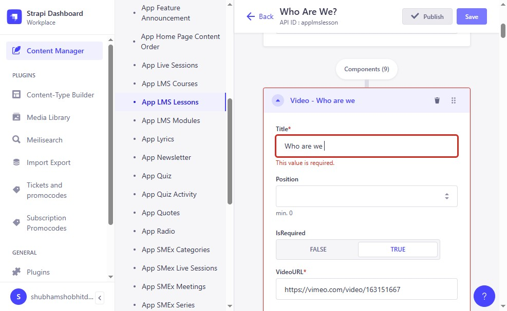
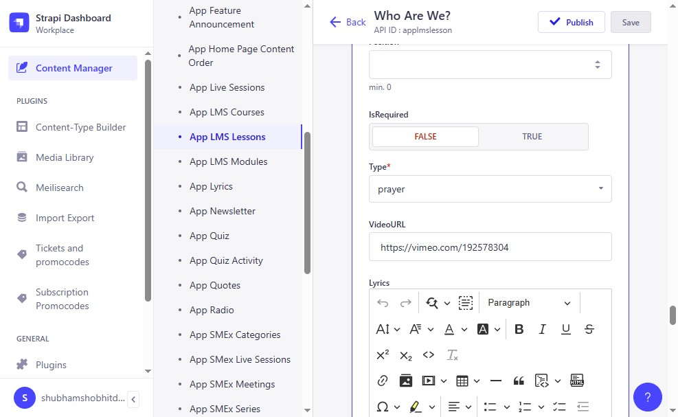

# Strapi Login & LMS Lesson Editing — Step-by-Step Guide

Extracted from `Strapi Login (2).docx`

All images referenced below are in the `images/` folder with the `strapi_login2_` prefix.

---

## Overview

This document walks through:
1. Logging in to the **Strapi staging environment**
2. Navigating to the **Content Manager**
3. Editing an **App LMS Lesson** (e.g., "Who Are We?")
4. Saving and Publishing changes

---

## Step 1: Navigate to the Login Page

- Go to: `https://jkyog-strapi-staging.up.railway.app/admin/auth/login`

---

## Step 2: Click "Login"

- Enter your credentials and click **Login**.

> Note: `image1.jpeg` is referenced twice — once for the login URL and once for the Login button click.

---

## Step 3: Click "Content Manager"

- In the left sidebar, click **Content Manager**.

---

## Step 4: Browse Collection Types

- You will see the Collection Types list (39+ types including App Announcement, App Articles, App Audios, App Books, App Challenge, etc.).

---

## Step 5: Click "App LMS Lessons"

- Select **App LMS Lessons** from the Collection Types list.

---

## Step 6: Click "Who Are We?"

- Select the lesson entry titled **"Who Are We?"** (or the entry you want to edit).

---

## Step 7: Click the "Title" Field

- Click on the **Title*** field to edit it.

---

## Step 8: Click "Save"

- After making changes, click **Save**.

---

## Step 9: Click "Publish"

- Click **Publish** to make the changes live.

---

## Step 10: Edit Lesson Details

- Click on the lesson detail fields:
  - **Title** (required)
  - **Position** (min. 0)
  - **IsRequired**
  - **VideoURL**
  - **Duration** (required)
  - **ThumbnailURL**

---

## Step 11: Click the "Title" Field (Lesson Detail)

- Click on the **Title*** field inside the lesson detail.

---

## Step 12: Type the Title

- Type the lesson title, e.g., **"Who are we"**.

---

## Step 13: Click the "Title" Field Again

- Confirm or adjust the title field.

---

## Step 14: Click "Save"

- Click **Save** to save the lesson detail changes.

---

## Step 15: Click "Publish"

- Click **Publish** to publish the lesson detail.

---

## Step 16: Navigate via Sidebar

- Click through the Strapi sidebar (Dashboard, Workplace, Content Manager, Plugins, Content-Type Builder, Media Library, Meilisearch, Import Export, Tickets, etc.).

---

## Step 17: Click "Publish" (Final)

- Click **Publish** again to confirm.

---

## Step 18: Click "Publish" (Complete)

- Final **Publish** click to complete the process.

---

## Complete Image Reference Map

All **17 image references** using **16 unique image files** (in order of appearance):

| # | Step / Context | Image File | Notes |
|---|---------------|------------|-------|
| 1 | Login page URL | `strapi_login2_image1.jpeg` | Login screen |
| 2 | Click "Login" | `strapi_login2_image1.jpeg` | *Same as #1 (reused)* |
| 3 | Click "Content Manager" | `strapi_login2_image2.jpeg` | Dashboard sidebar |
| 4 | Collection Types list | `strapi_login2_image3.jpeg` | 39+ types |
| 5 | Click "App LMS Lessons" | `strapi_login2_image4.jpeg` | LMS Lessons selected |
| 6 | Click "Who Are We?" | `strapi_login2_image5.jpeg` | Lesson entry |
| 7 | Click Title field | `strapi_login2_image6.jpeg` | Edit title |
| 8 | Click "Save" | `strapi_login2_image7.jpeg` | Save button |
| 9 | Click "Publish" | `strapi_login2_image8.jpeg` | Publish button |
| 10 | Lesson detail fields | `strapi_login2_image9.jpeg` | Title, Position, VideoURL, etc. |
| 11 | Title field (detail) | `strapi_login2_image10.jpeg` | Detail title |
| 12 | Title field (confirm) | `strapi_login2_image11.jpeg` | After typing |
| 13 | Save (detail) | `strapi_login2_image12.jpeg` | Save detail |
| 14 | Publish (detail) | `strapi_login2_image13.jpeg` | Publish detail |
| 15 | Sidebar navigation | `strapi_login2_image14.jpeg` | Full sidebar |
| 16 | Publish (confirm) | `strapi_login2_image15.jpeg` | Confirm publish |
| 17 | Publish (complete) | `strapi_login2_image16.jpeg` | Final publish |

---

## Key Takeaways

- **Staging URL:** `https://jkyog-strapi-staging.up.railway.app/admin/auth/login`
- This doc demonstrates editing **App LMS Lessons** specifically (the "Who Are We?" lesson)
- LMS Lesson fields: **Title**, **Position**, **IsRequired**, **VideoURL**, **Duration**, **ThumbnailURL**
- Workflow: Edit → **Save** → **Publish** (may need multiple publish clicks)
