# JKYOG Strapi CMS — Onboarding Guide

> **For new team members.** This document explains how the Strapi CMS works, what you can do, what you should avoid, and the end-to-end flow for managing content.

All referenced screenshots are in the `images/` folder.

---

## 1. What is Strapi?

Strapi is the **headless CMS** (Content Management System) used by JKYOG (JK Yog / Radha Krishna Temple) to manage content for:
- The **JKYOG website** (built on Webflow)
- The **RKT mobile app**
- **Event registration pages**
- **LMS (Learning Management System) lessons**

Content created in Strapi gets consumed by the website and app via APIs. You do NOT code anything in Strapi — you manage content through its admin panel.

---

## 2. Environments

| Environment | URL | Use For |
|-------------|-----|---------|
| **Production** | `https://prod-strapi.jkyog.org/admin` | Live content — changes go public |
| **Staging** | `https://jkyog-strapi-staging.up.railway.app/admin` | Testing — safe to experiment |

> **Rule:** Always test on **Staging** first before making production changes.

---

## 3. Login

1. Go to the Strapi admin URL
2. Enter your **Email** and **Password**
3. Click **Login**


> You will receive credentials from your team lead. Do NOT share them.

---

## 4. The Dashboard — What You See After Login

After logging in, you land on the **Strapi Dashboard**:


### Left Sidebar Sections

```
STRAPI DASHBOARD
|
|-- Content Manager        <-- Where you create/edit ALL content
|
|-- PLUGINS
|   |-- Content-Type Builder   <-- DO NOT TOUCH (admin only)
|   |-- Media Library          <-- Upload images/files
|   |-- Meilisearch            <-- Search indexing (admin only)
|   |-- Import Export          <-- Bulk data operations
|   |-- Tickets and Promocodes <-- Payment tickets for events
|   |-- Subscription Promocodes
|
|-- GENERAL
|   |-- Plugins               <-- DO NOT TOUCH
|   |-- Marketplace           <-- DO NOT TOUCH
|   |-- Settings              <-- DO NOT TOUCH (admin only)
```

---

## 5. Content Manager — The Main Work Area

This is where you spend 90% of your time. It contains **39 Collection Types**:


### Collection Types You Will Work With

| Collection Type | What It Does | How Often |
|----------------|--------------|-----------|
| **App Events** | Temple events (satsangs, retreats, festivals) | Frequently |
| **Event Email Templates** | Registration confirmation emails | Per event |
| **Live Streams** | Seva/sponsorship options + schedules | Per event |
| **App LMS Lessons** | Learning module content | Occasionally |
| **App Articles** | Blog/article content | Occasionally |
| **App Audios** | Audio content for the app | Occasionally |
| **App Books** | Book listings | Rarely |
| **App Announcements** | In-app notifications | As needed |

### Collection Types You Should NOT Touch (Without Permission)

| Collection Type | Why |
|----------------|-----|
| App Home Page Content Order | Controls app homepage layout |
| App Version | App versioning — critical |
| App SMEx Categories/Series | Structured content — needs coordination |
| Basic Page | Affects site-wide pages |

---

## 6. FLOW: Creating a New Event (End-to-End)

This is the most common task. Here's the complete flow:

```
                    START
                      |
                      v
        +---------------------------+
        |  1. Upload Banner Image   |
        |     (Media Library)       |
        +---------------------------+
                      |
                      v
        +---------------------------+
        |  2. Create App Event      |
        |     (Content Manager)     |
        +---------------------------+
                      |
              +-------+-------+
              |               |
              v               v
    +-----------------+  +-----------------+
    | 3. Add Content  |  | 4. Create Email |
    |  - Highlights   |  |    Template     |
    |  - Gallery      |  +-----------------+
    +-----------------+           |
              |                   |
              v                   v
        +---------------------------+
        |  5. Create Live Stream    |
        |     (Sevas + Schedule)    |
        +---------------------------+
                      |
                      v
        +---------------------------+
        |  6. Link Everything       |
        |  Event <-> LiveStream     |
        |  Event <-> Email Template |
        +---------------------------+
                      |
                      v
        +---------------------------+
        |  7. Save & Publish        |
        +---------------------------+
                      |
                      v
        +---------------------------+
        |  8. Webflow Integration   |
        |  (Registration form +     |
        |   eventUuid in embed)     |
        +---------------------------+
                      |
                      v
        +---------------------------+
        |  9. Payment Tickets       |
        |  (If paid event)          |
        +---------------------------+
                      |
                      v
                     DONE
```

### Step-by-Step Detail:

---

### 6.1 Upload Banner Image

**Where:** Media Library > Event Banner Image (1024 x 768)

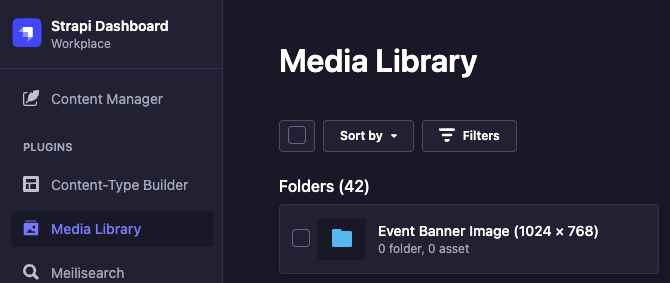

1. Click **Media Library** in sidebar
2. Open **Event Banner Image (1024 x 768)** folder
3. Click **Add New Assets** > upload your image
4. Click on the uploaded image > click the **chain link icon** to copy the URL

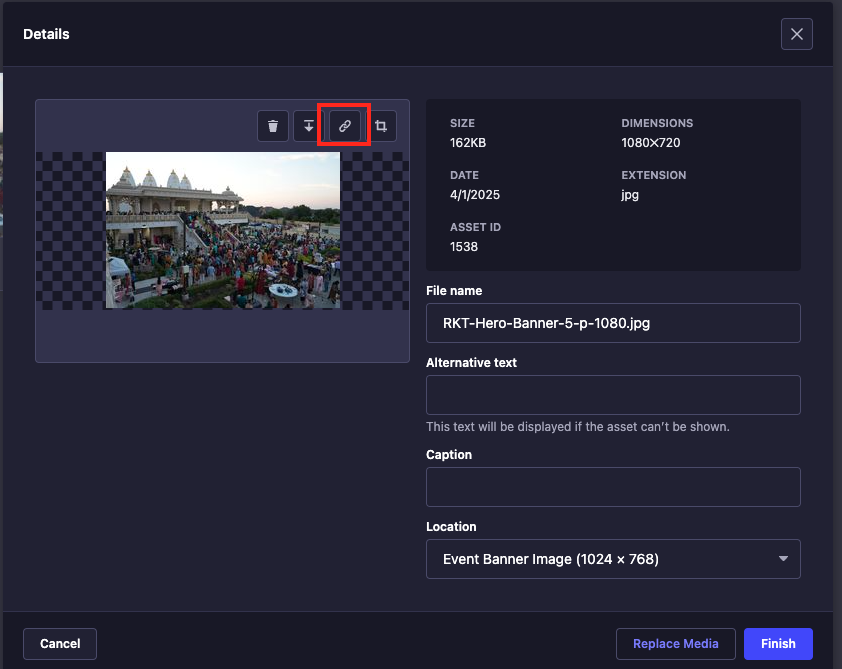

> **Save this URL** — you need it in the next step.

---

### 6.2 Create the App Event

**Where:** Content Manager > App Events

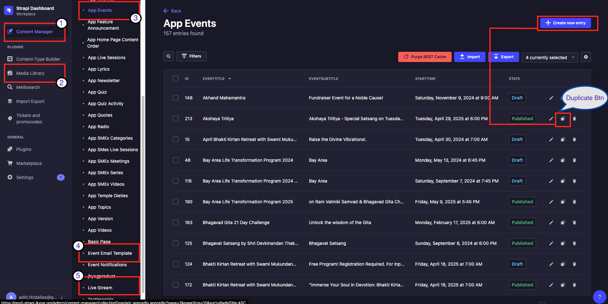

1. Click **+ Create new entry** (top right) or **Duplicate** an existing event
2. Fill in the required fields:

| Field | Example Value | Notes |
|-------|--------------|-------|
| **EventTitle** | Akshaya Tritiya | Event name |
| **EventSubtitle** | Special Satsang on Tuesday | Short description |
| **ImageURL** | *(paste from Media Library)* | The banner URL you copied |
| **WebsiteURL** | `https://www.radhakrishnatemple.net/akshaya-tritiya` | Event page URL |
| **BrevoContactListName** | `/rkt-akshaya-tritiya` | For email marketing |
| **EventURLSlug** | `akshaya-tritiya` | URL-friendly name |


| Field | Example Value | Notes |
|-------|--------------|-------|
| **uuid** | `d0af1ffd-c5b2-4f74-9a94-1b0d9d5dc781` | Auto-generated. **COPY THIS** for Webflow |
| **Language** | `en` | |
| **StartTime** | Date + Time | |
| **EventLocation** | `In-person` | |
| **TimeZone** | `CST` | |
| **ContactEmail** | `info@radhakrishnatemple.com` | |
| **ContactPhoneNumber** | `(469) 795-9130` | |
| **PricingType** | `free` | |
| **isEvent** | `false` | |
| **EventType** | `General` | |
| **EventPlatform** | `RKT` | |

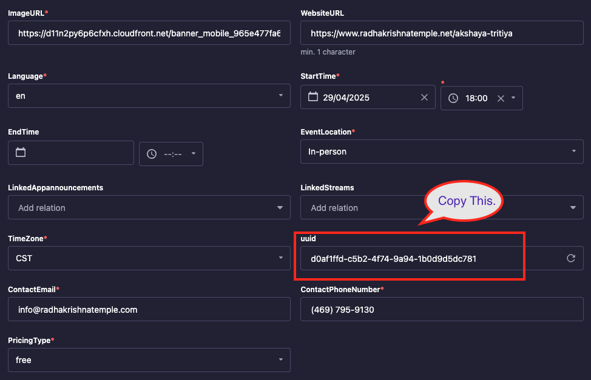

> **Critical:** The **uuid** is needed later for Webflow registration. Always copy it.

---

### 6.3 Add Content Components (Highlights + Gallery)

Still inside the App Event, scroll down to the **Content** section.

**Adding Highlights:**

1. Click **"+ Add a component to Content"**

   

2. Select **SelectTab** from the component picker

   

3. Set Title to `Highlights`

   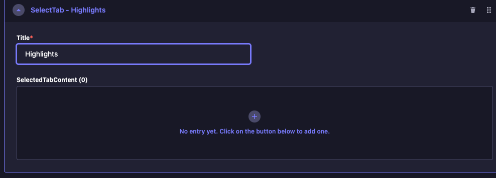

4. Click **+** to add individual highlights with **Title**, **Image**, and **Description**

   

**Adding Gallery:**

1. Click **"+ Add a component to Content"** again
2. Select **Gallery**
3. Set Title to `Gallery`, upload images

   

---

### 6.4 Create Email Template

**Where:** Content Manager > Event Email Template

1. Create new or duplicate existing
2. Set the **Subject** line
3. Update the email body
4. **Link it to the App Event** (or link from the Event side)
5. Save & Publish

---

### 6.5 Create Live Stream (Sevas + Schedule)

**Where:** Content Manager > Live Streams


1. Create new entry, add **Title**
2. Add **EventSevas** — for each seva:
   - **Title** (e.g., "Grand Sponsor")
   - **Price** (e.g., 2501)
   - **Description** (optional)

   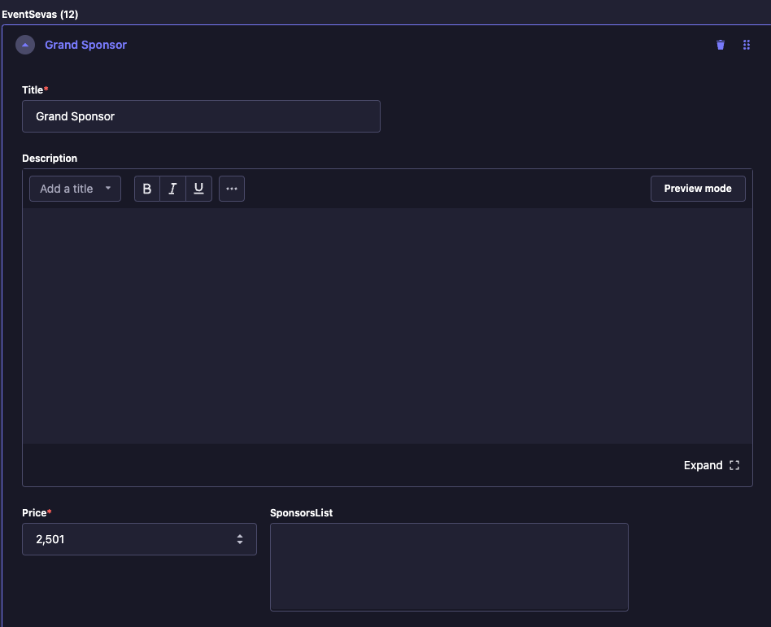

3. Add **Schedule** entries (for multi-day events):
   - **Date**, **StartTime**, **EndTime**
   - **TimeZone** (CST)
   - **Details** (rich text)

   

---

### 6.6 Link Everything Together

Back in the App Event:
- Set **LinkedStreams** → select your Live Stream

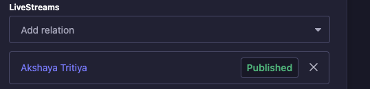

- Set **Email Template** → select your template
- **Save** first, then **Publish**

> **Important:** Always **Save** before switching between the Live Stream and Email Template tabs.

---

### 6.7 Webflow Integration (Registration Form)

**Where:** Webflow Editor (not Strapi)

1. **Copy** a working registration component from a previous event

   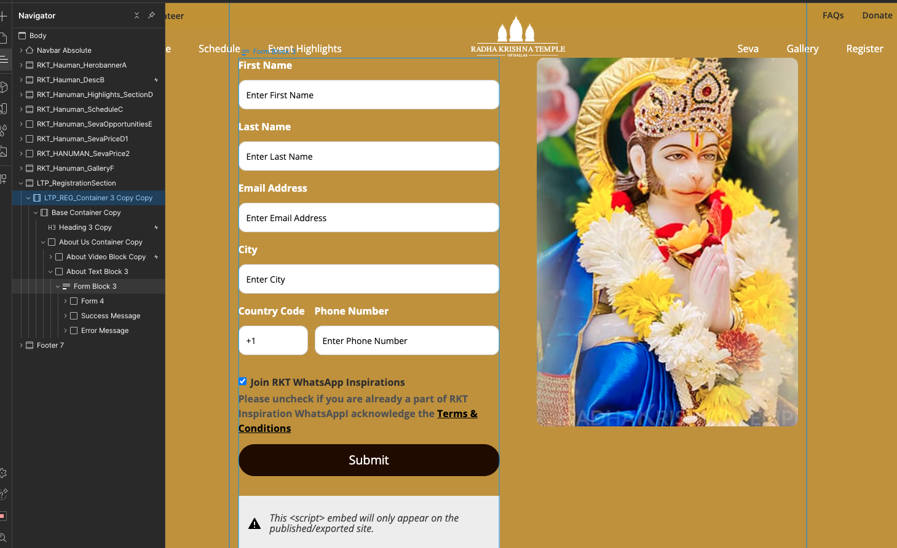

2. **Verify** the form field IDs match: `firstName`, `lastName`, `email`, `city`, `countryCode`, `phone`, `joinwhatsapp`

   

3. **Double-click** the Code Embed, find **line 25**, replace the `eventUuid` with the UUID from Strapi

   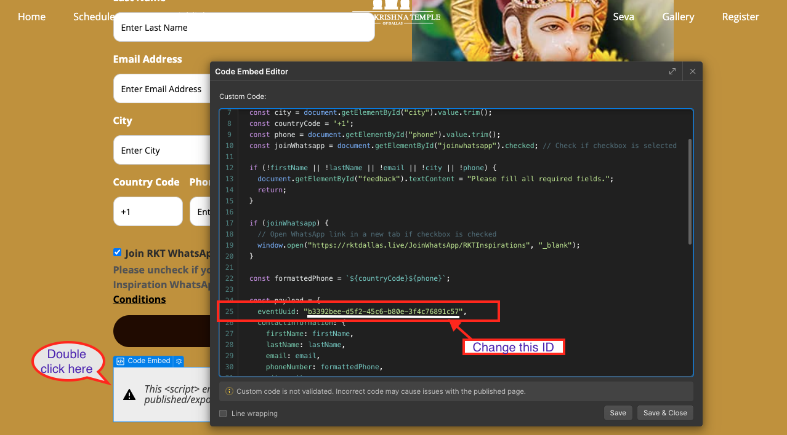

4. Save & Publish in Webflow

---

### 6.8 Payment Tickets (For Paid Events)

**Where:** Strapi > Tickets and Promocodes (left sidebar)

1. Search for the event name
2. Click **Show** on the event to expand
3. Click **+ Add ticket**
4. Enter ticket details (Type, Name, Price, Quantity, etc.)


> **If you skip this:** The registration form shows **$0** for paid events.


---

## 7. FLOW: Editing LMS Lessons

For learning content (App LMS Lessons):


1. Go to **Content Manager > App LMS Lessons**
2. Click on the lesson to edit
3. Update fields: **Title**, **Position**, **VideoURL**, **Duration**, **ThumbnailURL**


4. Click **Save**, then **Publish**


---

## 8. Special Case: Bhakti Kirtan Retreat

This event page works differently:

- **No registration block** in Webflow — buttons link directly to URLs
- **Seva opportunities** link to the registration URL with the event slug
- **Watch Live** button links to a page that embeds the Strapi Live Stream

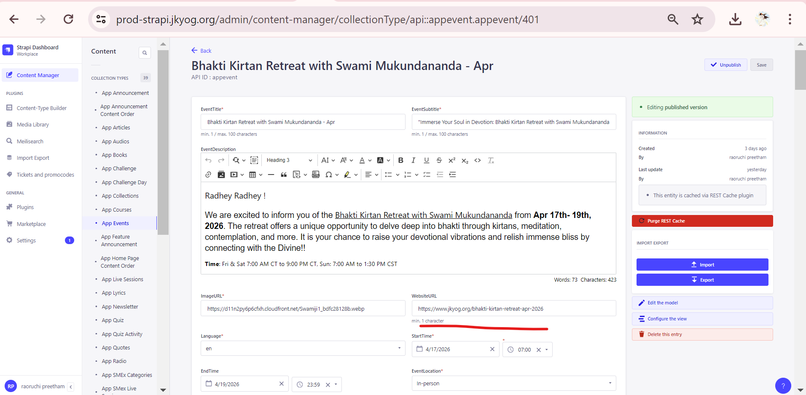
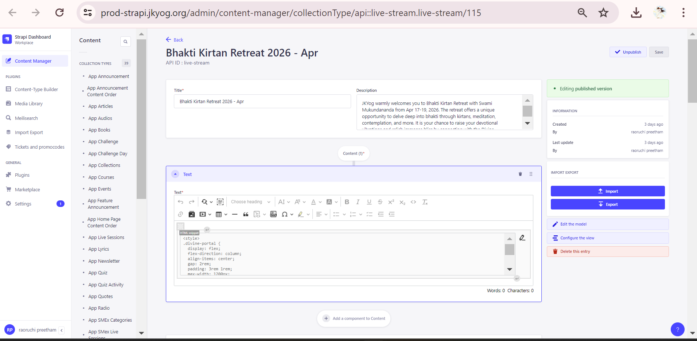
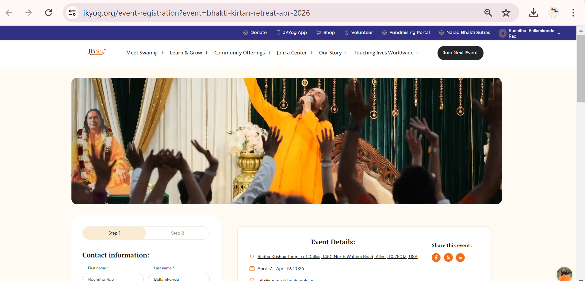

---

## 9. What You CAN Do

| Action | Where |
|--------|-------|
| Create/edit/publish **App Events** | Content Manager > App Events |
| Upload images | Media Library |
| Create **Email Templates** | Content Manager > Event Email Template |
| Create **Live Streams** with Sevas | Content Manager > Live Streams |
| Add **Schedules** to Live Streams | Content Manager > Live Streams |
| Edit **LMS Lessons** | Content Manager > App LMS Lessons |
| Manage **Tickets & Promocodes** | Tickets and Promocodes (sidebar) |
| **Import/Export** content | Import Export (sidebar) |
| **Duplicate** existing entries | Right-click or Duplicate button |

---

## 10. What You Should NOT Do

| Action | Why |
|--------|-----|
| Modify **Content-Type Builder** | Changes the database schema — can break APIs |
| Change **Settings** | User roles, API tokens, webhooks — admin only |
| Delete entries without approval | Published content may be live on the website/app |
| Modify **Plugins** or **Marketplace** | System-level changes — admin only |
| Edit entries someone else is editing | No conflict resolution — changes can be lost |
| Publish without **Saving first** | Unsaved changes will be lost |
| Forget to **copy the UUID** | Registration form won't work without it |
| Skip creating **Tickets** for paid events | Price shows as $0 on the form |
| Change **App Version** | Controls which app version users see |
| Modify **App Home Page Content Order** | Breaks the app homepage layout |

---

## 11. Common Mistakes & How to Avoid Them

| Mistake | Consequence | Prevention |
|---------|------------|------------|
| Not copying UUID | Webflow registration fails | Always copy UUID when creating event |
| Not creating ticket | Paid event shows $0 | Check Tickets & Promocodes for every paid event |
| Not linking Live Stream to event | No sevas show on event page | Always link LiveStreams field |
| Not removing old Email Template when duplicating | Wrong confirmation email sent | Remove old template before adding new one |
| Clicking Live Stream/Email tab without saving | Unsaved changes lost | Always Save before switching tabs |
| Wrong eventUuid in Webflow embed | Registration goes to wrong event | Double-check line 25 matches your event UUID |
| Wrong image size | Banner looks distorted | Use 1024 x 768 for event banners |

---

## 12. Glossary

| Term | Meaning |
|------|---------|
| **App Event** | An event entry in Strapi (satsang, retreat, festival, etc.) |
| **Live Stream** | A Strapi entry that holds Sevas and Schedules for an event |
| **Seva** | A sponsorship/donation option (e.g., Grand Sponsor $2,501) |
| **EventSevas** | The list of Sevas attached to a Live Stream |
| **UUID** | Unique ID for an event — used in Webflow registration embed |
| **EventURLSlug** | URL-friendly name (e.g., `akshaya-tritiya`) |
| **BrevoContactListName** | Brevo (email service) list name: `/rkt-[eventname]` |
| **SelectTab** | A Strapi component used for tabbed content (Highlights) |
| **Code Embed** | A Webflow element containing custom JavaScript |
| **Collection Type** | A category of content in Strapi (like a database table) |
| **Draft** | Unpublished entry — not visible to users |
| **Published** | Live entry — visible on website/app |
