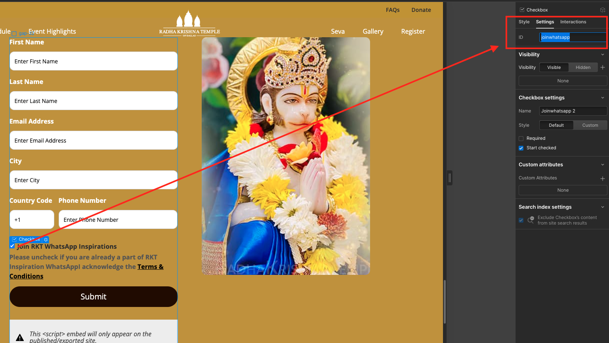

# Webflow Integration

[Back to Index](README.md) | Previous: [Creating Events](03-creating-events.md) | Next: [Payment Tickets](05-payment-tickets.md)

---

## Overview

After creating and publishing an event in Strapi, you need to set up the **registration form** on the JKYOG website (built in Webflow). This connects the website to the Strapi event via the **eventUuid**.

**Prerequisites:** You must have already created the App Event in Strapi and copied the **UUID**. If you haven't, go to [Creating Events](03-creating-events.md) first.

---

## Step 1: Copy the Event Registration Component

1. Open your event page in the **Webflow Editor**.
2. Use a previously working event registration form from events like *Ram Navami*, *Hanuman Jayanti*, *Holika Dahan*, or *Gujarati Bhajan Sandhya*.
3. Copy the registration component.

---

## Step 2: Paste the Component

Insert the copied registration component into your event page at the appropriate location.

---

## Step 3: Verify Input Field IDs

Ensure the pasted form has the correct input field IDs. These must match exactly:

| Field ID | Type |
|----------|------|
| `firstName` | Text input |
| `lastName` | Text input |
| `email` | Email input |
| `city` | Text input |
| `countryCode` | Text input |
| `phone` | Text input |
| `joinwhatsapp` | Checkbox |

> If any field ID is wrong or missing, the registration form will not submit correctly.

---

## Step 4: Edit the Embedded Code

1. Inside the registration component, find the **Code Embed** element.
2. **Double-click** on it to open the Code Embed Editor.

---

## Step 5: Update the eventUuid

This is the critical step that connects the form to your Strapi event.

1. Locate **line 25** in the embedded code.
2. Find the `eventUuid` value (it will contain the UUID from a previous event).
3. **Replace it** with the correct UUID from your new Strapi App Event.

> **Double-check** that the UUID matches your event. If it's wrong, registrations will go to the wrong event.

---

## Step 6: Save and Publish

1. Click **Save and Close** in the Code Embed Editor.
2. Click **Publish** in Webflow to make the registration form live.

---

## Troubleshooting

| Problem | Likely Cause | Fix |
|---------|-------------|-----|
| Registration form does nothing | Wrong or missing eventUuid | Check line 25 in the Code Embed |
| Form submits but data goes to wrong event | eventUuid from a different event | Copy the correct UUID from Strapi |
| Form fields don't submit | Field IDs don't match | Verify all 7 field IDs listed above |
| "Please fill all required fields" error | Missing required form fields | Ensure firstName, lastName, email, city, phone are present |

---

## Next Steps

- If the event is paid, set up tickets: [Payment Tickets](05-payment-tickets.md)
- Review the rules: [Dos and Don'ts](08-dos-and-donts.md)
