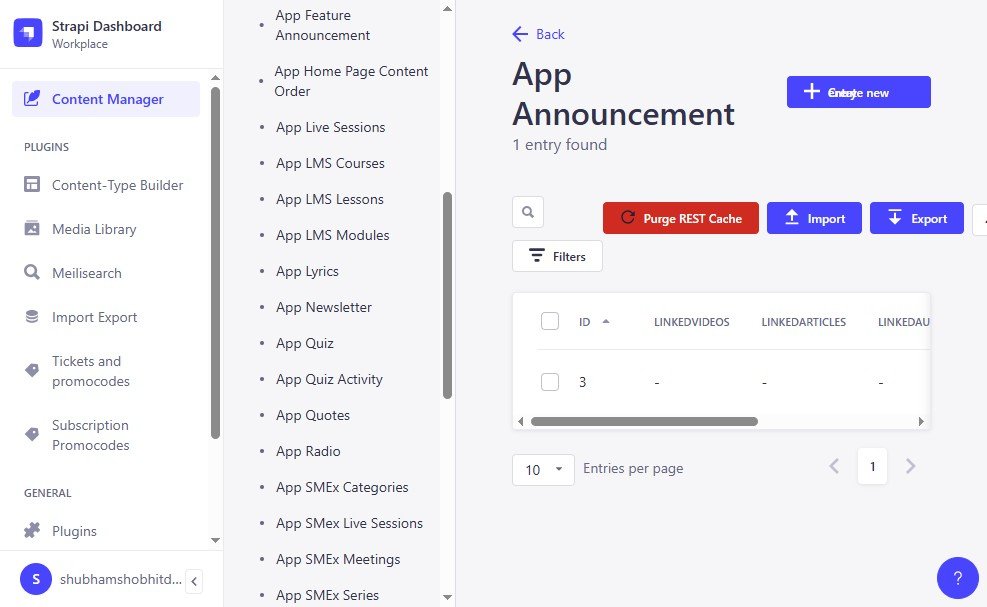

# Editing LMS Lessons

[Back to Index](README.md) | Previous: [Payment Tickets](05-payment-tickets.md) | Next: [Special Cases](07-special-cases.md)

---

## Overview

The **App LMS Lessons** collection type manages learning content for the JKYOG app. Each lesson has a title, video, duration, and other metadata.

**Where:** Content Manager > App LMS Lessons

---

## Steps

### Step 1: Navigate to App LMS Lessons

1. Click **Content Manager** in the sidebar.
2. Select **App LMS Lessons** from the Collection Types list.

### Step 2: Select a Lesson

Click on the lesson you want to edit (e.g., "Who Are We?").

### Step 3: Edit Lesson Fields

Update the fields as needed:

| Field | Description | Required |
|-------|------------|----------|
| **Title** | Lesson name (e.g., "Who Are We?") | Yes |
| **Position** | Order in the lesson list (min. 0) | No |
| **IsRequired** | Whether the lesson is mandatory | No |
| **VideoURL** | URL to the lesson video | No |
| **Duration** | Length of the lesson | Yes |
| **ThumbnailURL** | Preview image URL | No |

### Step 4: Save

Click **Save** to save your changes.

### Step 5: Publish

Click **Publish** to make the changes live in the app.

---

## Tips

- Always **Save** before **Publish** -- publishing without saving first may lose your changes.
- The **Position** field controls the order lessons appear. Lower numbers appear first.
- If you only want to save a draft without going live, just click **Save** and skip Publish.

---

## Next Steps

- [Special Cases](07-special-cases.md) -- non-standard workflows
- [Dos and Don'ts](08-dos-and-donts.md) -- review what you can and cannot do
