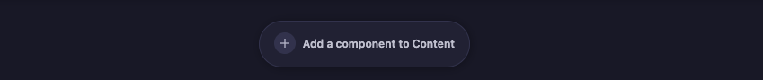
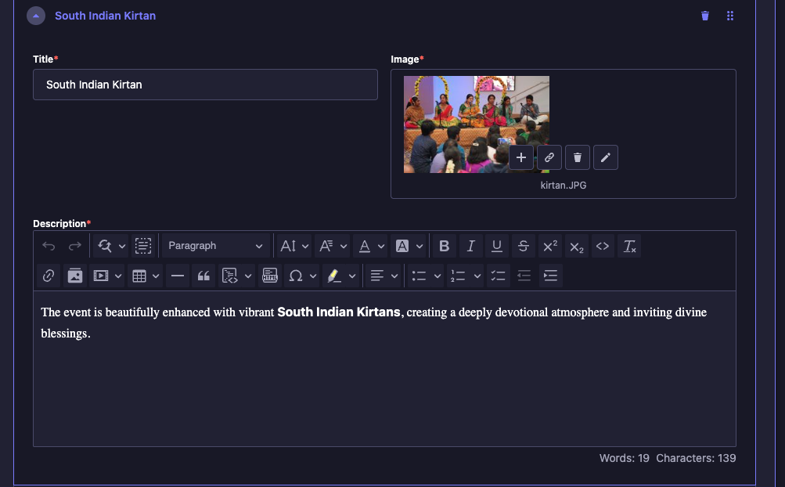
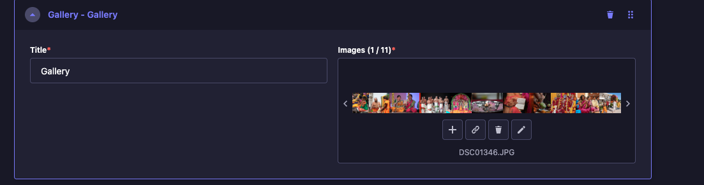
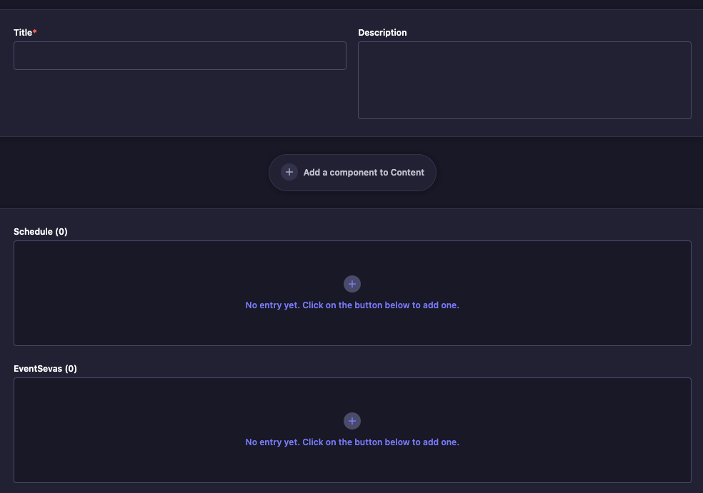
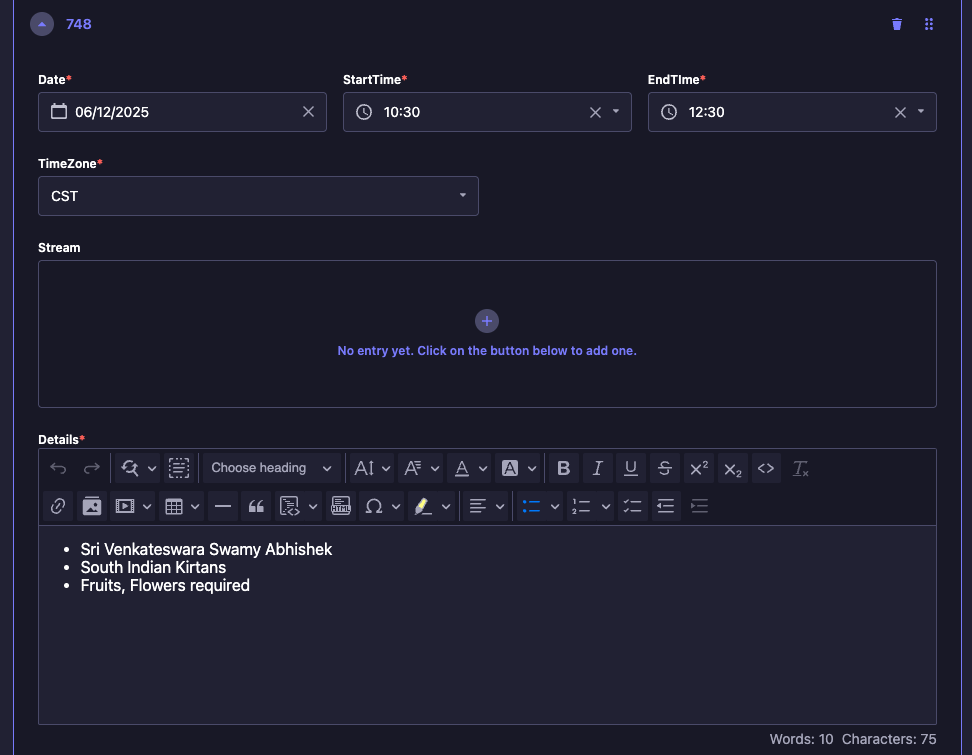
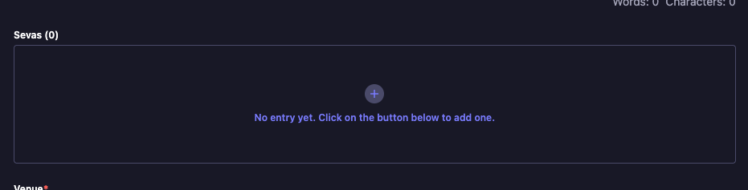

# Creating Events

[Back to Index](README.md) | Previous: [Strapi Overview](STRAPI-OVERVIEW.md) | Next: [Webflow Integration](WEBFLOW-INTEGRATION.md)

---

## Overview

Creating a new event is the most common task in Strapi. The full flow involves multiple steps across different sections. Here is the end-to-end process:

```
                         START
                           |
                           v
             +---------------------------+
             |  1. Upload Banner Image   |
             |     (Media Library)       |
             +---------------------------+
                           |
                           v
             +---------------------------+
             |  2. Create App Event      |
             |     (Content Manager)     |
             +---------------------------+
                           |
            +--------------+--------------+
            |              |              |
            v              v              v
  +-----------------+ +-----------+ +------------------+
  | 3. Add Content  | | 4. Create | | 5. Create Live   |
  |  - Highlights   | |    Email  | |    Stream        |
  |  - Gallery      | |  Template | |  (Sevas +        |
  +-----------------+ +-----------+ |   Schedule)      |
            |              |        +------------------+
            +--------------+--------------+
                           |
                           v
             +---------------------------+
             |  6. Link Everything       |
             |  Event <-> LiveStream     |
             |  Event <-> Email Template |
             +---------------------------+
                           |
                           v
             +---------------------------+
             |  7. Save & Publish        |
             +---------------------------+
                           |
                           v
                   Continue to:
              Webflow Integration
               Payment Tickets
```

> **Steps 3, 4, and 5 can be done in any order or in parallel.** They are independent tasks that only need to be completed before Step 6 (Link Everything).

After publishing, you also need to:
- Set up the registration form in Webflow -- see [Webflow Integration](WEBFLOW-INTEGRATION.md)
- Create tickets if the event is paid -- see [Payment Tickets](PAYMENT-TICKETS.md)

---

## Step 1: Upload Banner Image

**Where:** Media Library > Event Banner Image (1024 x 768)


1. Click **Media Library** in the sidebar.
2. Open the **Event Banner Image (1024 x 768)** folder.
3. Click **Add New Assets** > upload your image.
4. Click on the uploaded image > click the **chain link icon** to copy the URL.


> **Save this URL** -- you will paste it into the App Event in the next step.

---

## Step 2: Create the App Event

**Where:** Content Manager > App Events


1. Click **+ Create new entry** (top right) or click **Duplicate** on an existing event.
2. Fill in the required fields:

### Core Fields

| Field | Example Value | Notes |
|-------|--------------|-------|
| **EventTitle** | Akshaya Tritiya | Event name |
| **EventSubtitle** | Special Satsang on Tuesday | Short description |
| **ImageURL** | *(paste from Media Library)* | The banner URL you copied |
| **WebsiteURL** | `https://www.radhakrishnatemple.net/akshaya-tritiya` | Event page URL |
| **BrevoContactListName** | `/rkt-akshaya-tritiya` | For email marketing |
| **EventURLSlug** | `akshaya-tritiya` | URL-friendly name |


### Event Details

| Field | Example Value | Notes |
|-------|--------------|-------|
| **uuid** | `d0af1ffd-c5b2-4f74-9a94-1b0d9d5dc781` | Auto-generated. **COPY THIS** for Webflow |
| **Language** | `en` | |
| **StartTime** | Date + Time | |
| **EventLocation** | `In-person` | Dropdown: `Online`, `In-person`, `Both` |
| **TimeZone** | `CST` | Dropdown: `EST`, `CST`, `MST`, `IST`, `BST`, `PST` |
| **ContactEmail** | `info@radhakrishnatemple.com` | |
| **ContactPhoneNumber** | `(469) 795-9130` | |
| **PricingType** | `free` | Dropdown: `free` or `paid` -- controls pricing badge on the website |
| **isEvent** | `true` | Boolean (default: `true`). `true` = shows on Upcoming Events page; `false` = hidden |
| **IsRegistration** | `true` | Boolean (default: `true`). `true` = registration button active on the website |
| **EventType** | `General` | Multi-select dropdown. Values: `Retreat`, `Featured`, `MeetSwamiji`, `LifeTransformation`, `LifeTransformation2`, `LifeTransformation3`, `General`, `Yuth`, `SATSANG` |
| **EventPlatform** | `RKT` | Multi-select dropdown. Values: `JKYog`, `RKT`, `Krishna Bhagavad Gita`. Must include `RKT` for the event to appear on the RKT website |


> **Critical:** The **uuid** is needed later for Webflow registration. Always copy it when creating or duplicating an event.

> **Data Logic -- Read This:**
> - **isEvent** defaults to `true`. Controls whether the event appears on the Upcoming Events page. Only set to `false` if you want the event hidden from public listing.
> - **PricingType** controls the Free/Paid badge. If set to `paid`, you **must** also create tickets in [Payment Tickets](PAYMENT-TICKETS.md) or the price will show as $0.
> - **EventPlatform** is a **multi-select** dropdown. Select `RKT` for RKT website, `JKYog` for JKYog website, or both. If `RKT` is not selected, the event will NOT appear on the RKT website.
> - **EventType** is a **multi-select** dropdown. Select all applicable types (e.g., `Retreat` + `Featured` for a featured retreat).
> - **IsRegistration** defaults to `true`. Controls the registration button. Set to `false` to disable sign-ups.
>
> For the full explanation, see [API & Backend -- Data Logic](API-AND-BACKEND.md#data-logic----critical-fields).

---

## Step 3: Add Content Components

Still inside the App Event, scroll down to the **Content** section.

### Adding Highlights

1. Click **"+ Add a component to Content"**.

   

2. Select **SelectTab** from the component picker.

   

3. Set the Title to `Highlights`.

   

4. Click the **+** button to add individual highlights. For each one, fill in:
   - **Title** of the highlight
   - **Image**
   - **Description** (rich text)

   

5. Click **Save**.

### Adding Gallery

1. Click **"+ Add a component to Content"** again.
2. Select **Gallery** from the component picker.
3. Set the Title to `Gallery`.
4. Upload images as needed.

   

5. Click **Save** and then **Publish**.

---

## Step 4: Create Email Template

**Where:** Content Manager > Event Email Template

1. Create a new template or duplicate an existing one.
2. Set the **Subject** line.
3. Update the email body.
4. **Link it to the App Event** (or link from the Event side later).
5. Click **Save and Publish**.

> **If duplicating an event:** Remove the old Email Template first, then create or assign a new one. Otherwise the wrong confirmation email gets sent.

---

## Step 5: Create Live Stream (Sevas + Schedule)

**Where:** Content Manager > Live Streams

A Live Stream entry holds the **Sevas** (sponsorship options) and **Schedule** (multi-day timelines) for an event.



### Adding Sevas

1. Create a new Live Stream entry and add a **Title**.
2. Scroll to **EventSevas** and click **+** to add sevas.
3. For each seva, fill in:
   - **Title** (e.g., "Grand Sponsor")
   - **Price** (e.g., 2501)
   - **Description** (optional)
   - **SponsorsList** (optional)

   

4. Continue adding sevas as needed.

### Adding Schedule (Multi-Day Events)

If the event spans multiple days or has multiple time slots:

1. Scroll to the **Schedule** section.
2. Click **+** to add entries. For each one, fill in:
   - **Date**
   - **StartTime** and **EndTime**
   - **TimeZone** (CST)
   - **Stream** (optional)
   - **Details** (rich text -- e.g., list of activities)

   

3. Click **Save** after adding all schedule items.

### Adding Sevas to Schedule (Recurring Events)

For recurring events, you can attach Sevas directly to individual Schedule entries instead of using the top-level EventSevas. In that case, you can skip EventSevas.



---

## Step 6: Link Everything Together

Back in the **App Event** entry:

1. Set **LinkedStreams** -- select your Live Stream from the dropdown.

   

2. Set **Email Template** -- select your email template.
3. Click **Save** first.
4. Then click **Publish**.

> **Important:** Always **Save** before switching between the Live Stream and Email Template tabs. Unsaved changes will be lost.

---

## After Publishing

Your event is now live in Strapi. To complete the setup:

- **Set up the registration form on the website** -- see [Webflow Integration](WEBFLOW-INTEGRATION.md)
- **Create payment tickets** (if the event is paid) -- see [Payment Tickets](PAYMENT-TICKETS.md)

---

## Quick Checklist

- [ ] Upload event banner image (1024 x 768) to Media Library
- [ ] Copy image URL via chain link icon
- [ ] Create App Event with all required fields
- [ ] Copy the **UUID** (you will need it for Webflow)
- [ ] Set isEvent, EventType, EventPlatform
- [ ] Add Highlights (SelectTab component)
- [ ] Add Gallery component
- [ ] Create or link Email Template
- [ ] Create Live Stream with Sevas (Title + Price)
- [ ] Add Schedule entries if multi-day event
- [ ] Link Live Stream to the event (LinkedStreams field)
- [ ] Link Email Template to the event
- [ ] Save, then Publish

---

## Complete Field Reference

> For the full 58-field App Event schema (all fields, types, defaults, components, relations), see [Content Model -- Schema Deep Dive: App Event](MODEL.md#schema-deep-dive-app-event-58-fields).
