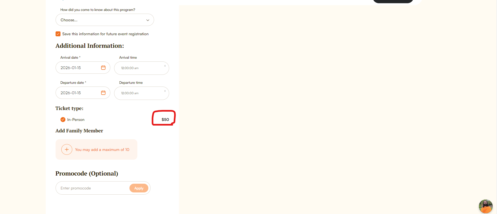
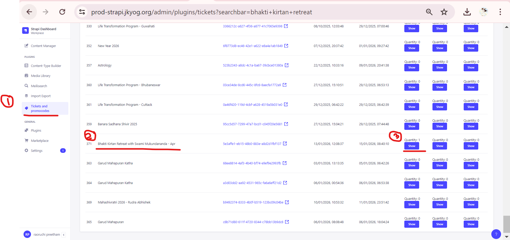
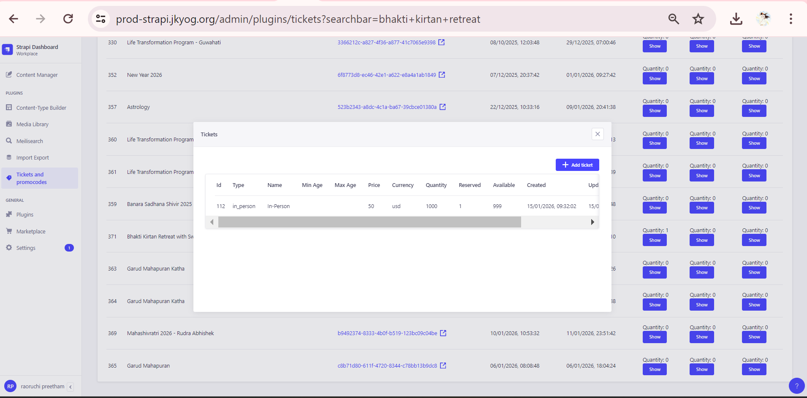

# Payment Tickets

[Back to Index](README.md) | Previous: [Webflow Integration](WEBFLOW-INTEGRATION.md) | Next: [Special Cases](SPECIAL-CASES.md)

---

## Overview

For **paid events** (e.g., retreats), you must create tickets in Strapi so that the registration form displays the correct price. If tickets are not configured, the form shows **$0**.

**Where:** Strapi sidebar > Tickets and Promocodes

---

## When Do You Need This?

- The event has a **ticket price** (e.g., $50 for In-Person)
- The registration form needs to show pricing and collect payment
- Examples: Retreats, special programs with fees

> **If you skip this step:** The registration form will show **$0** as the amount.

---

## Steps

### Step 1: Navigate to Tickets and Promocodes

In the Strapi sidebar, click **Tickets and Promocodes** under Plugins.

### Step 2: Search for the Event

Use the search bar to find the related website/page name (e.g., "bhakti kirtan retreat").

### Step 3: Expand the Event

Click **Show** on the event entry to expand it and see the ticket details.

### Step 4: Add a Ticket

1. Click **+ Add ticket**.
2. Enter the ticket details:

| Field | Example Value |
|-------|--------------|
| **Type** | `in_person` |
| **Name** | `In-Person` |
| **Price** | `50` |
| **Currency** | `usd` |
| **Quantity** | `1000` |

3. Save the ticket.

---

## Promocodes (Optional)

If the event supports discount codes:

1. Navigate to **Subscription Promocodes** in the sidebar.
2. Create a new promocode with the discount amount or percentage.
3. Link it to the event.

---

## Verification

After creating the ticket, verify on the live registration page that:
- The ticket type appears (e.g., "In-Person")
- The correct price is displayed (e.g., "$50")
- The payment flow works end-to-end

---

## Next Steps

- [Special Cases](SPECIAL-CASES.md) -- non-standard workflows
- [Business Rules](BUSINESS.md) -- permissions and safe zones
